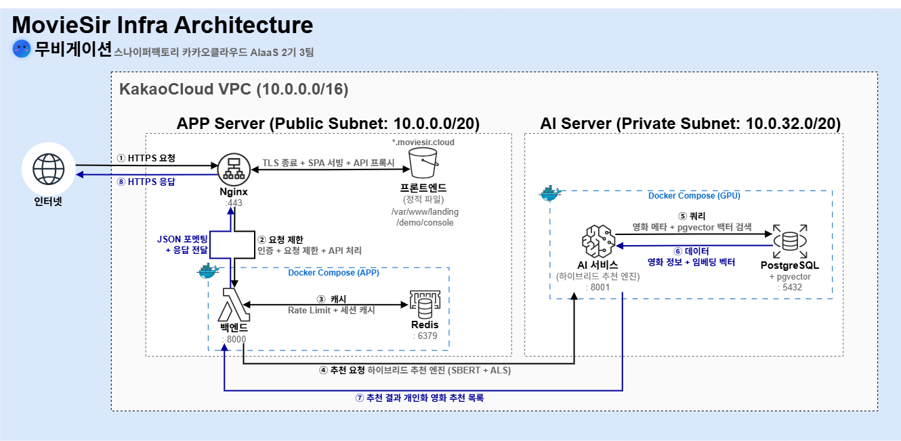

# MovieSir-Infra

> AI 기반 영화 추천 서비스 MovieSir의 인프라 구성입니다.

<div align="center">
  
</div>

<br/>

## 1. 인프라 개요

| 항목 | 내용 |
|------|------|
| 클라우드 | Kakao Cloud VPC |
| 컨테이너 | Docker Compose |
| CI/CD | GitHub Actions |
| 웹 서버 | Nginx (리버스 프록시 + SSL) |
| 인증서 | Let's Encrypt (Certbot 자동 갱신) |

---

## 2. 서버 구성

### 2.1 App Server (t1i.xlarge)

| 항목 | 값 |
|------|-----|
| vCPU / RAM | 4 / 16GB |
| Storage | 10GB SSD |
| Public IP | `<APP_PUBLIC_IP>` |
| Private IP | `<APP_PRIVATE_IP>` |
| 위치 | Public Subnet |
| 역할 | Nginx + FastAPI Backend + Redis |
| 포트 | 80 (HTTP), 443 (HTTPS), 52222 (SSH) |

**컨테이너 구성**
| 컨테이너 | 이미지 | 포트 | 역할 |
|-----------|--------|------|------|
| moviesir-backend | 자체 빌드 (FastAPI) | 8000 | API 서버 |
| moviesir-redis | redis:7-alpine | 6379 | 세션/캐시, Rate Limiting |
| dozzle | amir20/dozzle | 9999 | 컨테이너 로그 모니터링 UI |

### 2.2 GPU Server (gn1i.xlarge)

| 항목 | 값 |
|------|-----|
| vCPU / RAM | 4 / 16GB |
| GPU | NVIDIA Tesla T4 (16GB VRAM) |
| Storage | 100GB SSD |
| Public IP | 미부여 (Private Subnet) |
| Private IP | `<GPU_PRIVATE_IP>` |
| 역할 | PostgreSQL + AI 추천 엔진 |
| 포트 | 22 (SSH), 5432 (DB), 8001 (AI) |

**컨테이너 구성**
| 컨테이너 | 이미지 | 포트 | 역할 |
|-----------|--------|------|------|
| moviesir-ai | 자체 빌드 (FastAPI + PyTorch) | 8001 | AI 추천 엔진 (SBERT + ALS) |
| moviesir-postgres | pgvector/pgvector:pg16 | 5432 | PostgreSQL 16 + pgvector |
| dozzle | amir20/dozzle | 9999 | 컨테이너 로그 모니터링 UI |

---

## 3. 네트워크 구성

```
KakaoCloud VPC (10.0.0.0/16)
├── Public Subnet (10.0.0.0/20)
│   └── App Server (<APP_PRIVATE_IP>)
│       ├── Nginx :80/:443 → 외부 트래픽 수신
│       ├── Backend :8000 → API 처리
│       └── Redis :6379 → 세션/Rate Limit
│
└── Private Subnet (10.0.32.0/20)
    └── GPU Server (<GPU_PRIVATE_IP>)
        ├── PostgreSQL :5432 → 데이터베이스
        └── AI Service :8001 → 추천 엔진
```

### 도메인 구성

| 도메인 | 서비스 | 서빙 방식 |
|--------|--------|-----------|
| moviesir.cloud | 랜딩 페이지 | Nginx 정적 파일 (/var/www/landing) |
| demo.moviesir.cloud | B2C Demo App | Nginx 정적 파일 (/var/www/demo) + API 프록시 |
| console.moviesir.cloud | B2B Console | Nginx 정적 파일 (/var/www/console) + /b2b/ 프록시 |
| api.moviesir.cloud | B2B API 소개 + External API | Nginx 정적 파일 (/var/www/api) + /v1/, /b2b/ 프록시 |

**api.moviesir.cloud 상세 라우팅**

| 경로 | 처리 방식 | 용도 |
|------|-----------|------|
| `/` | 정적 파일 (SPA) | B2B API 소개 페이지 |
| `/v1/*` | FastAPI 프록시 | External API 엔드포인트 |
| `/b2b/*` | FastAPI 프록시 | B2B Console API |
| `/swagger`, `/redoc` | FastAPI 프록시 | API 문서 (Swagger UI, ReDoc) |

### Nginx 설정

**SSL/TLS 설정** (`/etc/nginx/snippets/ssl-params.conf`)

| 항목 | 값 |
|------|-----|
| TLS 버전 | TLSv1.2, TLSv1.3 |
| HSTS | max-age=63072000 (2년), includeSubDomains |
| 인증서 | Let's Encrypt (`/etc/letsencrypt/live/moviesir.cloud/`) |

**서버 블록 구성**

| 블록 | listen | server_name | 역할 |
|------|--------|-------------|------|
| HTTP 리다이렉트 | 80 | 전체 5개 도메인 | `301 → https://` + Let's Encrypt 인증용 경로 |
| 랜딩 페이지 | 443 ssl http2 | moviesir.cloud, www | 정적 파일 (`/var/www/landing`) |
| Demo App | 443 ssl http2 | demo.moviesir.cloud | SPA + API 프록시 8개 |
| B2B Console | 443 ssl http2 | console.moviesir.cloud | SPA + `/b2b/` 프록시 |
| External API | 443 ssl http2 | api.moviesir.cloud | SPA + API 프록시 5개 |

**demo.moviesir.cloud 프록시 라우팅**

| 경로 | 프록시 대상 | 용도 |
|------|-------------|------|
| `/api/` | 127.0.0.1:8000 | API 엔드포인트 |
| `/auth/` | 127.0.0.1:8000 | 인증 (로그인/회원가입) |
| `/onboarding/` | 127.0.0.1:8000 | 온보딩 플로우 |
| `/movies/` | 127.0.0.1:8000 | 영화 정보 |
| `/users/` | 127.0.0.1:8000 | 사용자 관리 |
| `/mypage/` | 127.0.0.1:8000 | 마이페이지 |
| `/recommendation/` | 127.0.0.1:8000 | 추천 서비스 |
| `/registration/` | 127.0.0.1:8000 | 회원가입 |

**api.moviesir.cloud 프록시 라우팅**

| 경로 | 프록시 대상 | 용도 |
|------|-------------|------|
| `/v1/` | 127.0.0.1:8000 | External API 엔드포인트 |
| `/b2b/` | 127.0.0.1:8000 | B2B Console API |
| `/swagger` | 127.0.0.1:8000 | Swagger UI |
| `/redoc` | 127.0.0.1:8000 | ReDoc 문서 |
| `/openapi.json` | 127.0.0.1:8000 | OpenAPI 스펙 |

**캐싱 정책** (전체 도메인 공통)

| 대상 | 설정 | 목적 |
|------|------|------|
| `index.html` | `no-cache, no-store, must-revalidate` | 새 배포 즉시 반영 |
| 정적 파일 (js, css, 이미지, 폰트) | `expires 1y`, `public, immutable` | 장기 캐싱 |

**프록시 공통 헤더**

```nginx
proxy_http_version 1.1;
proxy_set_header Host $host;
proxy_set_header X-Real-IP $remote_addr;
proxy_set_header X-Forwarded-For $proxy_add_x_forwarded_for;
proxy_set_header X-Forwarded-Proto $scheme;
```

> CORS는 Nginx가 아닌 **FastAPI 미들웨어**에서 처리 (중복 헤더 방지)

### 요청 흐름

```
사용자 → Nginx (:443, SSL)
  ├── 정적 파일 → /var/www/{landing,demo,console}/
  └── API 요청 → proxy_pass → FastAPI (:8000)
                                  ├── Redis (:6379) — 세션, Rate Limit
                                  └── AI Service (<GPU_PRIVATE_IP>:8001)
                                       └── PostgreSQL (:5432) — 영화 데이터, 벡터
```

---

## 4. 배포 구조

### 4.1 CI/CD 파이프라인 (GitHub Actions)

**트리거 조건**: `dev` 또는 `main` 브랜치에 push 시 자동 실행

#### Frontend 배포 (`deploy-frontend.yml`)

```
frontend/** 또는 frontend-console/** 변경 감지
  ↓
GitHub Actions Runner (ubuntu-latest)
  ├── npm ci && npm run build (Demo App)
  ├── npm ci && npm run build (Console)
  ↓
SSH → App Server
  ├── rsync → /var/www/demo/
  ├── rsync → /var/www/console/
  └── nginx -t && systemctl reload nginx
```

#### Backend 배포 (`deploy-backend.yml`)

```
backend/** 변경 감지
  ↓
GitHub Actions Runner
  ↓
SSH → App Server
  ├── git pull origin {branch}
  ├── docker compose down
  ├── docker compose up -d --build
  └── 헬스 체크 확인
```

#### AI 배포 (`deploy-gpu.yml`)

```
ai/inference/** 또는 ai/api.py 변경 감지
  ↓
GitHub Actions Runner
  ↓
SSH → App Server (Bastion) → GPU Server (ProxyJump)
  ├── git pull origin {branch}
  ├── docker compose -f docker-compose.gpu.yml down
  ├── docker compose -f docker-compose.gpu.yml up -d --build
  └── 헬스 체크 확인
```

### 4.2 환경변수 관리

```
GitHub Secrets (암호화 저장)
  ↓ CI/CD 실행 시
.env.production (서버에 생성)
  ↓ docker compose 실행 시
docker-compose.yml environment 매핑
  ↓
컨테이너 내부 환경변수
```

| 저장소 | 용도 |
|--------|------|
| GitHub Secrets | SSH 키, DB 비밀번호, JWT 시크릿, API 키 |
| .env.production | 서버 런타임 환경변수 |
| docker-compose.yml | 컨테이너 환경변수 매핑 |

---

## 5. 보안 구성

### 5.1 네트워크 보안

| 항목 | 설정 |
|------|------|
| GPU Server | Private Subnet 배치, Public IP 미부여 |
| SSH 접속 | ProxyJump (App Server를 Bastion Host로 사용) |
| SSH 포트 | 22 → **52222**로 변경 (브루트포스 방어) |
| 방화벽 | UFW (Ubuntu Firewall) 활성화 |
| 보안그룹 | 서비스별 최소 포트만 허용 |

**App Server 보안그룹 인바운드**

| 포트 | 프로토콜 | 소스 | 용도 |
|------|----------|------|------|
| 80 | TCP | 0.0.0.0/0 | HTTP (→ HTTPS 리다이렉트) |
| 443 | TCP | 0.0.0.0/0 | HTTPS |
| 52222 | TCP | 관리자 IP | SSH |

**GPU Server 보안그룹 인바운드**

| 포트 | 프로토콜 | 소스 | 용도 |
|------|----------|------|------|
| 22 | TCP | `<APP_PRIVATE_IP>` (App Server) | SSH (ProxyJump) |
| 5432 | TCP | `<APP_PRIVATE_IP>` | PostgreSQL |
| 8001 | TCP | `<APP_PRIVATE_IP>` | AI Service |

### 5.2 SSH 접속 구조

```
개발자 PC
  ↓ SSH (포트 52222)
App Server (Bastion Host)
  ↓ SSH (포트 22, Private IP)
GPU Server
```

```bash
# ~/.ssh/config
Host moviesir-app
    HostName <APP_PUBLIC_IP>
    User ubuntu
    IdentityFile ~/project03.pem
    Port 52222

Host moviesir-gpu
    HostName <GPU_PRIVATE_IP>
    User ubuntu
    IdentityFile ~/project03.pem
    ProxyJump moviesir-app
```

### 5.3 침입 방지

| 도구 | 설정 | 역할 |
|------|------|------|
| fail2ban | SSH 5회 실패 시 10분 차단 | 브루트포스 방어 |
| UFW | 허용 포트 외 전부 차단 | 방화벽 |
| Nginx | HTTPS 강제 리다이렉트 | 전송 암호화 |

---

## 6. 모니터링 구성

### 6.1 컨테이너 로그 모니터링 (Dozzle)

| 항목 | App Server | GPU Server |
|------|------------|------------|
| 접속 | localhost:9999 | localhost:9999 |
| 방식 | SSH 터널링 | SSH 터널링 (ProxyJump) |
| 대상 | backend, redis | ai, postgres |

```bash
# App Server 로그 UI
ssh moviesir-app -L 9999:localhost:9999
# → http://localhost:9999

# GPU Server 로그 UI
ssh moviesir-gpu -L 9998:localhost:9999
# → http://localhost:9998
```

### 6.2 서버 자동화 스크립트

**App Server (`~/scripts/`)**

| 스크립트 | 역할 |
|----------|------|
| `healthcheck.sh` | Backend HTTP 200 확인, Nginx 상태, 디스크/메모리 사용량 → `~/logs/`에 기록 |
| `disk-alert.sh` | 디스크 사용률 80% 초과 시 경고 출력 |
| `weekly-cleanup.sh` | journalctl 7일 이전 로그 정리 + `docker system prune -f` |
| `renew-ssl.sh` | Let's Encrypt SSL 인증서 갱신 |

**GPU Server (`/usr/local/bin/`)**

| 스크립트 | 역할 |
|----------|------|
| `backup-db.sh` | PostgreSQL 일일 백업 (`pg_dump`), 7일 보관 (`find -mtime +7 -delete`) |

**Cron 설정 (root crontab, 평일 운영)**

```bash
# App Server
0 1 * * 1-5   /usr/local/bin/renew-ssl.sh >> /var/log/ssl-renew.log 2>&1  # 매일 01:00 SSL 갱신
30 9 * * 1-5  /home/ubuntu/scripts/healthcheck.sh    # 매일 09:30 상태 체크
30 17 * * 1-5 /home/ubuntu/scripts/disk-alert.sh     # 매일 17:30 디스크 체크
0 17 * * 5    /home/ubuntu/scripts/weekly-cleanup.sh # 매주 금 17:00 정리

# GPU Server
0 8 * * 1-5   /usr/local/bin/backup-db.sh >> /var/log/db-backup.log 2>&1  # 매일 08:00 DB 백업
```

**시스템 타이머 (자동)**

| 타이머 | 주기 | 역할 |
|--------|------|------|
| `certbot.timer` | 12시간마다 | SSL 인증서 자동 갱신 체크 |
| `logrotate.timer` | 매일 | 시스템 로그 로테이션 |

---

## 7. API 레이턴시 측정 결과

App Server에서 3회 반복 측정한 결과입니다.

| 측정 구간 | 평균 응답 | 경로 |
|-----------|-----------|------|
| AI Service Direct | ~200ms | App Server → GPU Server (AI :8001) |
| B2B External API | ~360ms | Client → Nginx → FastAPI → AI → 응답 |

목표: 1초(1000ms) 이내 → **달성**

---

## 8. 폴더 구조

```
MovieSir-Infra/
├── docker/                    # Docker Compose 구성
│   ├── docker-compose.yml         # App Server (Production)
│   ├── docker-compose.gpu.yml     # GPU Server (Production)
│   ├── docker-compose.local.yml   # Local Development
│   └── README.md
│
├── cicd/                      # GitHub Actions 워크플로우
│   ├── deploy-frontend.yml        # Frontend 배포
│   ├── deploy-backend.yml         # Backend 배포
│   ├── deploy-gpu.yml             # GPU Server 배포
│   └── README.md
│
├── nginx/                     # Nginx 설정
│   ├── moviesir.conf              # 4개 서브도메인 서버 블록
│   ├── ssl-params.conf            # TLS 1.2/1.3 보안 설정
│   └── README.md
│
├── scripts/                   # 서버 자동화 스크립트
│   ├── app-server/
│   │   ├── disk-alert.sh
│   │   ├── healthcheck.sh
│   │   └── weekly-cleanup.sh
│   ├── gpu-server/
│   │   └── backup-db.sh
│   └── README.md
│
├── docs/                      # 문서 및 이미지
│   └── moviesir_infra.png
│
└── README.md
```

---

## 9. 운영 명령어

### 서비스 시작/종료

```bash
# App Server
cd ~/MovieSir
docker compose --env-file .env.production up -d      # 시작
docker compose --env-file .env.production down        # 종료

# GPU Server
cd ~/MovieSir
docker compose -f docker-compose.gpu.yml --env-file .env.production up -d    # 시작
docker compose -f docker-compose.gpu.yml --env-file .env.production down     # 종료
```

### 상태 확인

```bash
docker ps                                    # 컨테이너 상태
docker logs moviesir-backend --tail 50       # 백엔드 로그
docker logs moviesir-ai --tail 50            # AI 로그
curl -s http://localhost:8000/               # 백엔드 헬스체크
curl -s http://localhost:8001/health         # AI 헬스체크
```

### 트러블슈팅

| 증상 | 원인 | 해결 |
|------|------|------|
| Docker 빌드 실패 | 빌더 캐시 손상 | `docker builder prune -f` |
| 502 Bad Gateway | 백엔드 컨테이너 미실행 | `docker compose up -d` |
| DB 연결 실패 | PostgreSQL 미시작 | GPU Server `docker ps` 확인 |
| SSH 접속 불가 | 포트 변경 미반영 | `Port 52222` 확인 |

---

## 관련 링크

- [MovieSir 메인 레포지토리](https://github.com/Movigation/MovieSir)
- [기술 블로그](https://velog.io/@leelaeloo)
